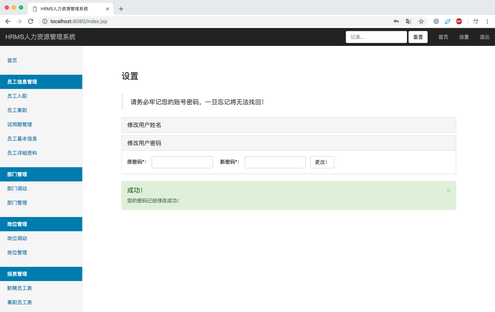

# HRMS 人力资源管理系统
Human Resources Management System

### 程序运行截图

### 开发环境
- IntelliJ IDEA 2018.1.6
- JDK 1.8
- Tomcat 9.0
- MySQL 5.6

### 使用方法

1. 将project.sql导入到数据库中。
2. 使用admin账号和密码1登录系统。
3. Enjoy it。

### End